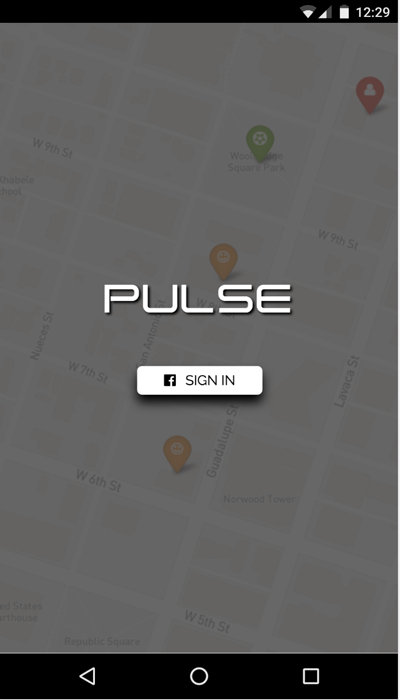
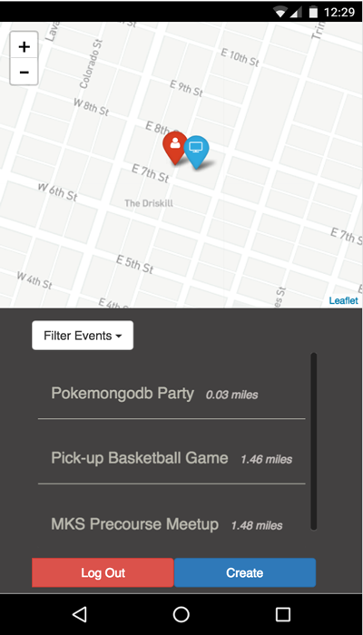
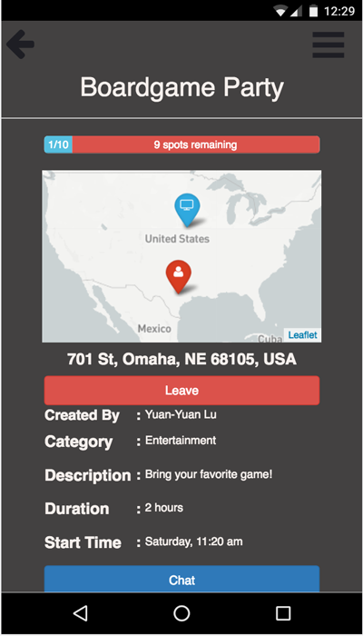
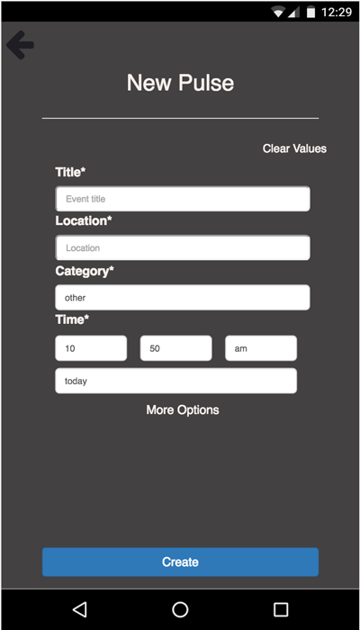

Event Pulse
==============================

  - [Description](#description)
    - [Tech Stack](#tech-stack)
    - [Authors](#authors)
  - [Usage](#usage)
    - [Getting Started](#getting-started)
    - [Testing](#testing)
    - [Server API Reference](#server-api-reference)
    - [External API Keys](#external-api-keys)
  - [Contributing](#contributing)

# Description

[Event Pulse](https://eventpulse.herokuapp.com) is a social broadcasting app that enables users to find and create spontaneous events happening nearby.

  * Users are required to login through Facebook, and then are presented with a map and list of events within a 50 mile radius.
  * Users can click on any individual event to view that event's details and chat with other guests or invite additional guests.
  * Users can create their own events happening within the next 12 hours.

  
  
  
  

### Tech Stack
  * React
  * Redux
  * Webpack
  * Node/Express
  * PostgreSQL with Knex
  * Socket.io
  * Enzyme/Mocha/Chai for testing

### Authors
  * [Chuwei Lu](https://github.com/sxcw)
  * [David Lewallen](https://github.com/davidlewallen)
  * [Jad Carson](https://github.com/jadcarson)
  * [Kenneth Torng](https://github.com/ktorng)
  * [Tony Kung](https://github.com/lpstandard)

# Usage
### Getting started
* Set up [PostGreSQL](docs/PostgreSETUP.md)

* Install dependencies
> npm install

* Set up environment variables
> npm run setup

* Start the server
> npm start

Open your browser to http://localhost:3000 to view!

### Testing
* Run test suite
> npm test

* Run code coverage (make sure you have babel-cli installed globally)
> npm run cover

### Server API Reference
See [Server API Endpoints](docs/ServerAPI.md)

### External API Keys
Our code relies on several APIs. To run the code with full functionality, you will need to get several keys in order to access these APIs.

You will need to create a [Facebook Development](https://developers.facebook.com) account and register a new app.

`FACEBOOK_ID` = Facebook App ID

`FACEBOOK_SECRET`= Facebook App Secret

`GEO_API_KEY` = [Google Geocoding API](https://developers.google.com/maps/documentation/geocoding/start)

`MAP_API_KEY` = [Mapbox Access Token](https://www.mapbox.com/help/create-api-access-token/)

# Contributing
Got an idea? Great! Create an issue describing your update, then fork the repo and create a branch named `feat#`, where `#` is the issue number. When ready, put in a pull request to [master in this repo](https://github.com/ConstGitSum/EventPulse).

See contributing [guidelines](docs/CONTRIBUTING.md).
